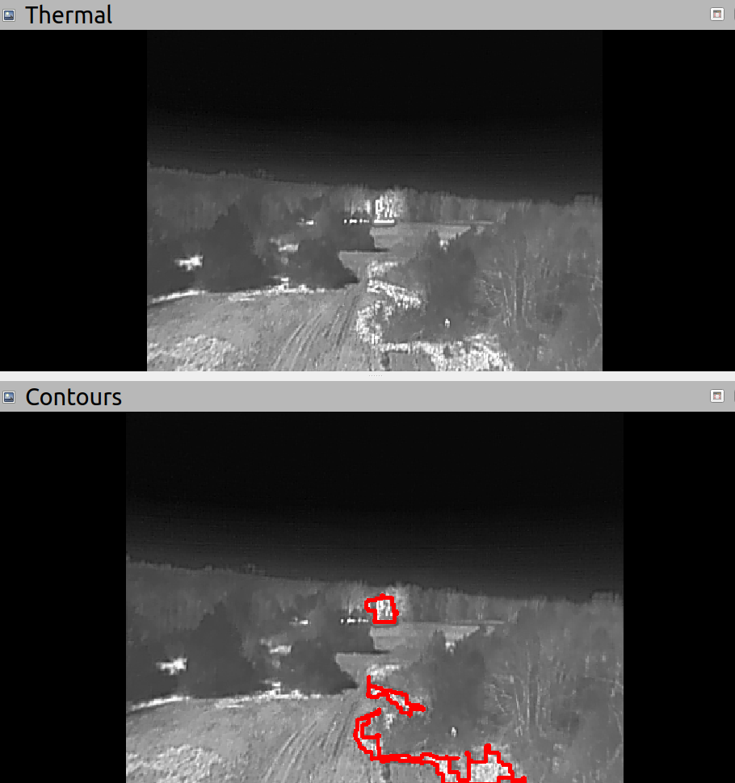

# thermal-pipeline

Thermal imagery pipeline tailored to differentiating between flames/embers and e.g. hot, recently burned areas. The threshold is set very high as a result. Future improvements will require multispectral image analysis. Currently, it is susceptible to false positives.

Resulting imagery looks like:

## testing

Build tests with:

`catkin build thermal_88 --catkin-make-args run_tests`

To run the tests, launch the respective test file with, e.g.,

`rostest task_manager tests_thermal.launch`

To see print statements at levels lower than WARN, use:

`rostest task_manager tests_thermal.launch --text`