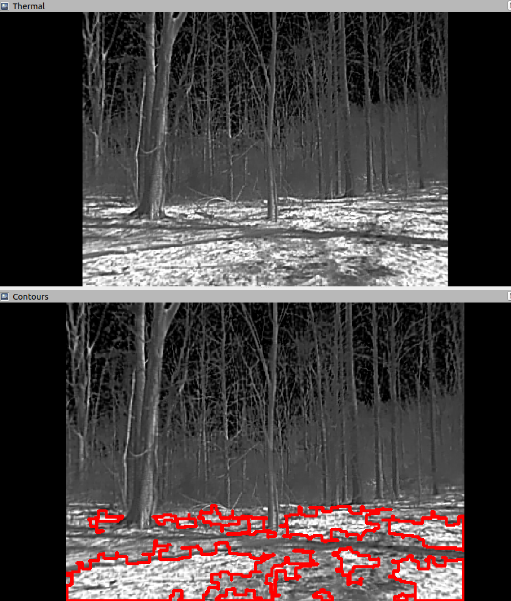
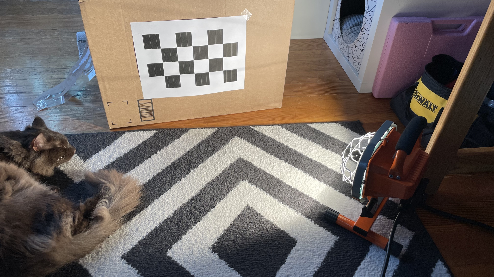

# thermal-pipeline

Thermal imagery pipeline tailored to differentiating between flames/embers and e.g. hot, recently burned areas. The threshold is set very high as a result. Future improvements will require multispectral image analysis. Currently, it is susceptible to false positives.

Resulting imagery looks like:

But false positives look like:

## testing

Build tests with:

`catkin build thermal_88 --catkin-make-args run_tests`

To run the tests, launch the respective test file with, e.g.,

`rostest task_manager tests_thermal.launch`

To see print statements at levels lower than WARN, use:

`rostest task_manager tests_thermal.launch --text`

# calibration

This thermal calibrator should be used as a last resort. Results are not as good as with the built-in ROS camera calibrator, but this calibrator is able to detect the chessboard more easily, so if the ROS calibrator is failing to even get enough detections to save, this method can be used. However, first try everything to get the ROS calibrator working. For the Seek camera, which returned chessboard detections probably less than 1% of the time in sunlight, I used the following setup to finally get the ROS node working:

The lamp is the [250 watt HDX halogen work light](https://www.homedepot.com/p/HDX-250-Watt-Portable-Halogen-Work-Light-265669/300453898). I printed a pattern from [here](https://markhedleyjones.com/projects/calibration-checkerboard-collection) and that worked better than an actual chessboard because it wasn't as reflective. I used the checkerboard A2 85mm 5x3 pattern, and ran:

`rosrun camera_calibration cameracalibrator.py --size 5x3 --square 0.85 image:=/seek_thermal/image_raw camera:=/seek_thermal`

In the unfortunate event that nothing else is working, you can use this node with:

`roslaunch thermal_88 thermal_calibration.launch`

Calibration matrices will be printed to the terminal, so you need to copy them into the respective camera info yaml file.